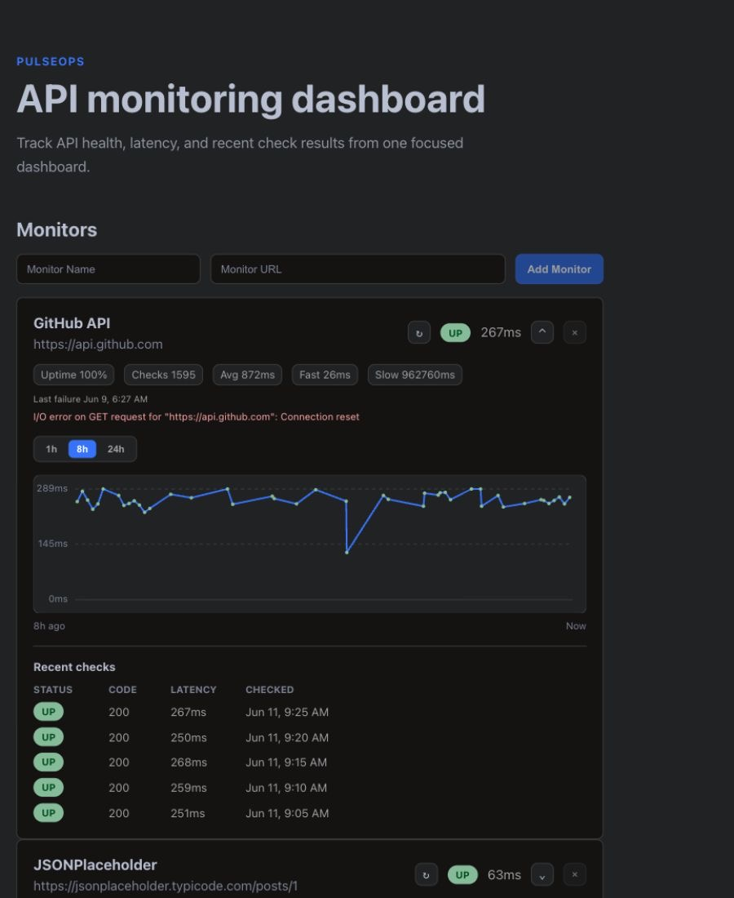

# PulseOps

PulseOps is a full-stack API monitoring dashboard built with a React frontend, a Spring Boot REST API, and PostgreSQL.

PulseOps currently supports adding API monitors, running manual and scheduled health checks, storing recent check history, deleting monitors, and viewing status, latency, uptime percentage, response-time summaries, latest errors, and last failure time from the frontend.

The roadmap tracks upcoming work such as chart-ready history, richer uptime analytics, incident records, alerts, and AI-assisted incident summaries.

## Screenshots



## Project Goal

Build a resume-ready app that demonstrates:

- REST API design
- HTTP client calls from the backend
- PostgreSQL persistence
- API health checks
- latency tracking, uptime summaries, and recent check history
- React dashboard UI
- clean separation between frontend and backend

## Current Demo Story

A user adds an API endpoint to the monitor list, runs a health check, and sees the latest status, status code, response time, uptime percentage, response-time summary statistics, latest error, last failure time, and recent check history.

## Tech Stack

- Frontend: React with Vite
- Backend: Java Spring Boot
- Database: PostgreSQL
- Tests: Spring Boot integration tests with H2

## Project Structure

```text
pulseops/
  backend/
  frontend/
  docs/
    API.md
    ARCHITECTURE.md
    ROADMAP.md
    SETUP.md
```

## Documentation

- [Setup](docs/SETUP.md)
- [API contract](docs/API.md)
- [Architecture](docs/ARCHITECTURE.md)
- [Roadmap](docs/ROADMAP.md)

## Current Features

Users can:

- add an API endpoint to the monitor list
- manually run a health check
- receive scheduled background checks every 5 minutes
- see status code, response time, and last checked time
- see uptime percentage and total checks
- see average, fastest, and slowest response times
- see the latest request error and last failure time
- view recent check history
- delete monitors and their check history

The backend also exposes a curated public APIs endpoint that can be connected to the frontend discovery flow later.

## What Is Next

See the [Roadmap](docs/ROADMAP.md) for planned work and feature priorities. The next likely product step is a chart-ready check history API followed by frontend latency and status charts.
