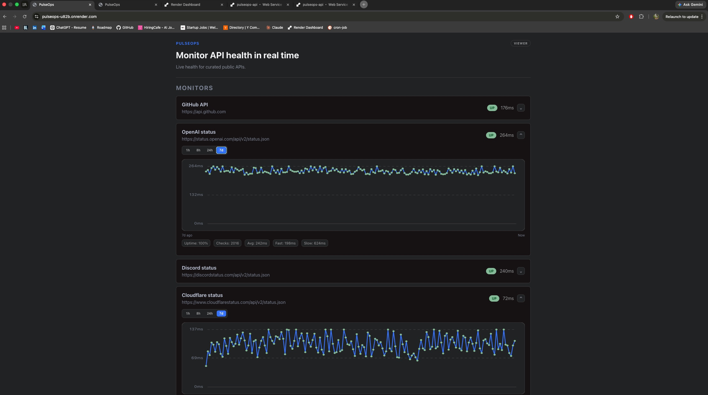

# PulseOps

PulseOps is a full-stack API monitoring dashboard built with a React frontend, a Spring Boot REST API, and PostgreSQL.

**Live demo:** [https://pulseops-u82b.onrender.com/](https://pulseops-u82b.onrender.com/)

PulseOps supports adding API monitors, running manual and scheduled health checks, storing check history, deleting monitors, and viewing status, latency, uptime percentage, response-time summaries, mapped failure reasons, last failure time, and selectable latency charts from the frontend. The public demo is read-only and monitors a curated set of real APIs on a 5-minute schedule.

The roadmap tracks upcoming work such as discovery UI, uptime timelines, incident records, alerts, and optional self-hosting.

## Screenshots



## Project Goal

Build a resume-ready app that demonstrates:

- REST API design
- HTTP client calls from the backend
- PostgreSQL persistence
- API health checks
- latency tracking, uptime summaries, and chart-window analytics
- React dashboard UI
- clean separation between frontend and backend

## Current Demo Story

A visitor opens the live dashboard and sees curated API monitors updating every 5 minutes with status, latency, uptime percentage, mapped failure reasons, and expandable latency charts. Local development still supports the full Admin flow: add a monitor, run a manual check, and inspect the same summaries in a polished dashboard layout.

## Tech Stack

- Frontend: React with Vite
- Backend: Java Spring Boot
- Database: PostgreSQL
- Tests: Spring Boot integration tests with H2

## Project Structure

```text
pulseops/
  backend/
  frontend/
  docs/
    API.md
    ARCHITECTURE.md
    ROADMAP.md
    SETUP.md
```

## Documentation

- [Setup](docs/SETUP.md)
- [API contract](docs/API.md)
- [Architecture](docs/ARCHITECTURE.md)
- [Roadmap](docs/ROADMAP.md)

## Current Features

Users can:

- add an API endpoint to the monitor list
- manually run a health check
- receive scheduled background checks every 5 minutes
- see status code, response time, and last checked time
- see uptime percentage and total checks
- see average, fastest, and slowest response times
- see mapped failure reasons and last failure time
- view latency charts for the last 1, 8, 24 hours, or 7 days
- inspect chart points for exact check details
- benefit from frontend chart caching, including a 1-hour TTL for 7d chart data
- delete monitors and their check history

The backend also exposes a curated public APIs endpoint that can be connected to the frontend discovery flow later.

## What Is Next

See the [Roadmap](docs/ROADMAP.md) for planned work and feature priorities. Likely next themes: demo polish (README screenshot, GitHub monitor tweak), a curated API discovery UI, or uptime timeline charts.
